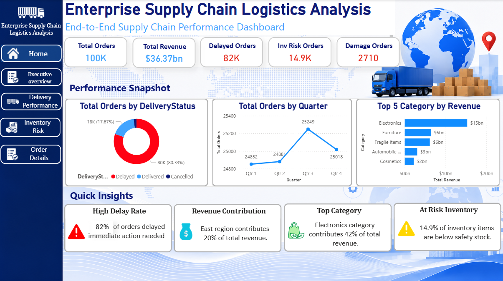
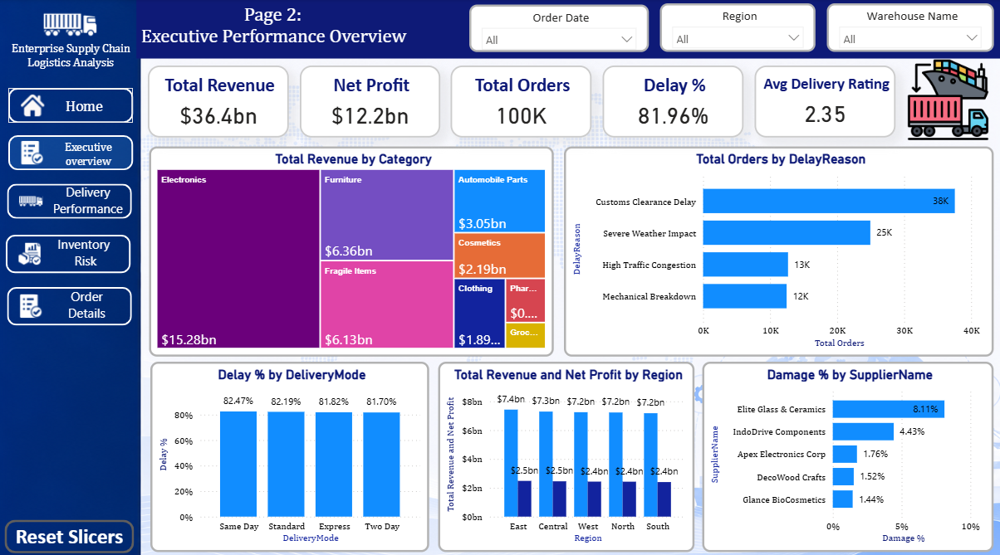
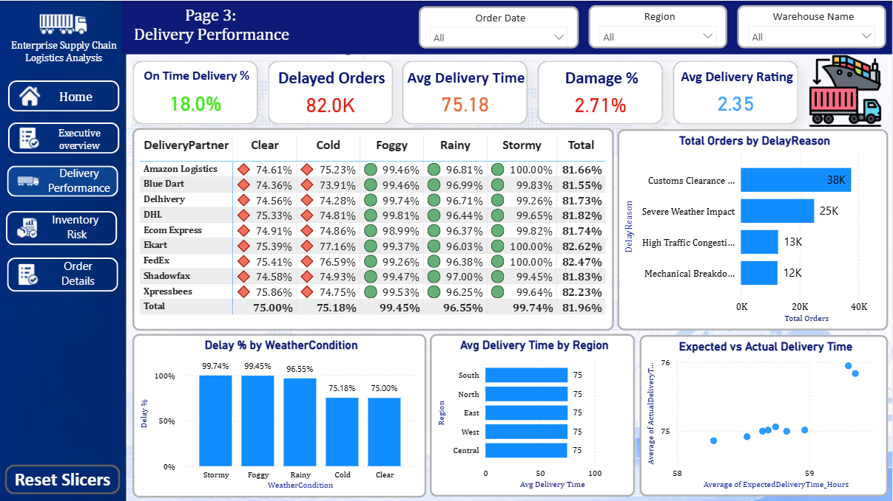
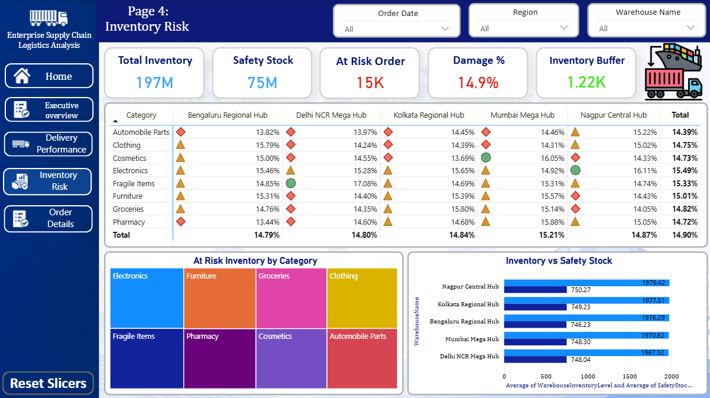
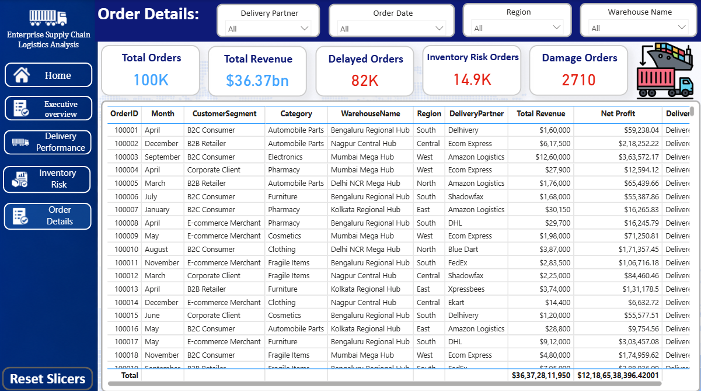

<h1 align="center">Enterprise Supply Chain & Logistics Optimization Platform</h1>

<p align="center">
  
  
  
  
</p>

## Project Overview

Enterprise Supply Chain Logistics Analysis is an end-to-end Power BI analytics solution designed to monitor and optimize supply chain operations through interactive dashboards and business intelligence reporting.

The project focuses on delivery performance, inventory risk monitoring, supplier quality assessment, operational efficiency, and order-level analysis. The dashboard provides actionable insights that support data-driven decision-making across logistics and supply chain functions.

---

## Business Objective

Supply chain organizations face challenges related to:

* Delivery delays
* Inventory shortages
* Product damages
* Supplier performance monitoring
* Logistics efficiency
* Operational visibility

The objective of this project is to develop an interactive Power BI dashboard that enables stakeholders to identify operational bottlenecks, monitor key performance indicators, and improve supply chain performance.

---

## Dataset Information

The project uses a simulated enterprise supply chain dataset containing operational, inventory, warehouse, supplier, and logistics information.

### Dataset Characteristics

* One Year of Operational Data
* 100,000 Orders
* Multiple Warehouses
* Multiple Suppliers
* Multiple Delivery Partners
* Multiple Product Categories
* Revenue and Profit Metrics
* Inventory Monitoring Metrics
* Delivery Performance Metrics

---

## Data Model

### Fact Table

* Fact_Orders

### Dimension Tables

* Dim_Product
* Dim_Customer
* Dim_Supplier
* Dim_Warehouse
* Dim_Partner

The data model follows a star schema approach for efficient reporting and analytical performance.

---

## Dashboard Pages

### Page 1: Home

Executive landing page providing an overall snapshot of supply chain performance.

#### KPIs

* Total Orders
* Total Revenue
* Delayed Orders
* Inventory Risk Orders
* Damage Orders

#### Insights

* High Delay Rate
* Revenue Contribution
* Top Revenue Category
* Inventory Risk Status

---

### Page 2: Executive Performance Overview

Provides high-level operational and financial performance analysis.

#### Visualizations

* Revenue by Category
* Delay Reason Analysis
* Revenue and Profit by Region
* Damage Percentage by Supplier

#### KPIs

* Total Revenue
* Net Profit
* Total Orders
* Delay Percentage
* Average Delivery Rating

---

### Page 3: Delivery Performance

Focused on delivery efficiency and delay investigation.

#### Visualizations

* Delay Performance Heatmap
* Delay Reason Analysis
* Delay Percentage by Weather Condition
* Delivery Partner Analysis

#### KPIs

* On-Time Delivery Percentage
* Delayed Orders
* Average Delivery Time
* Damage Percentage
* Average Delivery Rating

---

### Page 4: Inventory Risk

Monitors inventory health and stock exposure.

#### Visualizations

* Inventory Risk Heatmap
* Inventory versus Safety Stock
* At Risk Inventory by Category

#### KPIs

* Total Inventory
* Safety Stock
* At Risk Orders
* Inventory Risk Percentage
* Inventory Buffer

---

### Page 5: Order Details

Operational drill-through page for detailed order-level analysis.

#### Features

* Order Tracking
* Delivery Status Monitoring
* Revenue Tracking
* Profit Tracking
* Inventory Risk Monitoring
* Damage Monitoring

---

## Key Performance Indicators

| KPI                         | Description                                |
| --------------------------- | ------------------------------------------ |
| Total Revenue               | Total revenue generated from orders        |
| Net Profit                  | Overall profitability                      |
| Total Orders                | Number of processed orders                 |
| Delay Percentage            | Percentage of delayed orders               |
| On-Time Delivery Percentage | Orders delivered on schedule               |
| Average Delivery Rating     | Customer delivery satisfaction             |
| Damage Percentage           | Percentage of damaged orders               |
| Inventory Risk Percentage   | Inventory below safety stock               |
| Inventory Buffer            | Available inventory above safety threshold |

---

## Key Business Insights

### Delivery Performance

* More than 80 percent of orders experienced delivery delays.
* Customs Clearance Delay was the largest contributor to delayed deliveries.
* Severe Weather Impact was the second largest contributor to delivery delays.

### Revenue Performance

* Electronics generated the highest revenue contribution among all categories.
* East region contributed the highest overall revenue share.

### Inventory Risk

* Approximately 15 percent of inventory remained below safety stock levels.
* Certain product categories showed higher inventory exposure compared to others.

### Supplier Quality

* Damage rates varied significantly across suppliers.
* Supplier-level monitoring can help reduce damaged shipments and improve service quality.

---

## Tools and Technologies

* Power BI Desktop
* Power Query
* DAX
* Data Modeling
* Microsoft Excel
* Data Visualization
* Business Intelligence Reporting

---

## Repository Structure

```text
enterprise-supply-chain-logistics-analysis/
│
├── 01_raw_data/
│   └── Enterprise_Supply_Chain_Dataset.xlsx
│
├── 02_powerbi_report/
│   └── Enterprise_Supply_Chain_Logistics_Analysis.pbix
│
├── 03_documentation/
│   └── Business_Requirements_&_Data_Dictionary.txt
│
├── assets/
│   ├── home_page.png
│   ├── executive_overview.png
│   ├── delivery_performance.png
│   ├── inventory_risk.png
│   └── order_details.png
│
└── README.md
```

---

## Dashboard Screenshots

### Home Page



### Executive Performance Overview



### Delivery Performance



### Inventory Risk



### Order Details



---

## How To Use

1. Download the repository.
2. Open the Power BI report located inside the 02_powerbi_report folder.
3. Refresh the dataset if required.
4. Interact with filters and slicers to explore operational insights.
5. Navigate across dashboard pages using the built-in navigation menu.

---

## Project Highlights

✔ End-to-End Supply Chain Analytics

✔ Executive-Level KPI Monitoring

✔ Delivery Performance Investigation

✔ Inventory Risk Assessment

✔ Supplier Quality Analysis

✔ Interactive Power BI Dashboard

✔ Star Schema Data Modeling

✔ DAX-Based KPI Development

---

## Author

### Vipul Paighan

Email: [vipul.paighan.in@gmail.com](mailto:vipul.paighan.in@gmail.com)

GitHub: https://github.com/vipulsystems

---

## License

This project is intended for educational, portfolio, and demonstration purposes.
